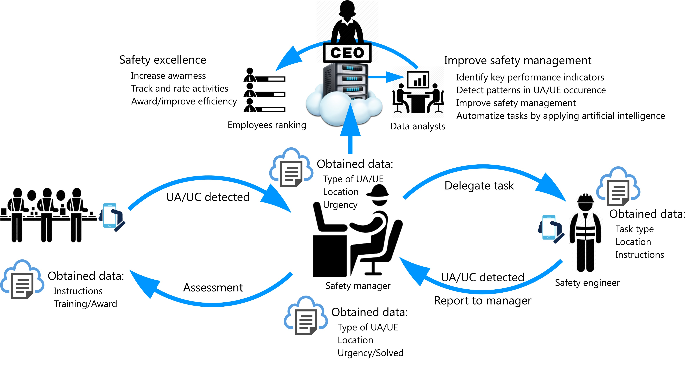

This repository is supplement to the study (http://dx.doi.org/10.1016/j.ssci.2019.07.024):

# SafE-Tag mobile: A novel javascript framework for real-time management of unsafe conditions and unsafe acts in SMEs

 
Arso M. Vukicevic*,1, Marko Djapan1, Miladin Stefanovic1,  Ivan Macuzic1   

 
1 Faculty of engineering, University of Kragujevac, Kragujevac, Serbia  
*Corresponding author {arso_kg@yahoo.com; +381643483552; Sestre Janjic 6, 34000 Kragujevac, Serbia}

Nowadays industries have initiative to reduce a number of production injuries and accidents down to zero. This goal could be achieved only through the proactive identification of accident precursors – such as unsafe conditions (UC) and unsafe acts (UA), whose control could prevent occurrence of accidents. At the same time, smartphones (and mobile applications) are taking dominance over PCs, making mobile devices major interface for human interaction with the web. In this term, application of mobile devices in OSH remains to be more exploited and accepted. Taking into account these trends, the present study aims to propose a novel cloud-based mobile framework for the management of UC/UA reports. Compared to previous studies, we considered the recent trends of mobile, cloud and Safety 4.0 in more details – ending up with the solution that is the combo of JavaScript technologies. 

Compared to the original study - this one is extended with new features, and the backend was reimplemented in PHP programming language

# Key features
• Management of unsafe conditions (UC) and unsafe acts (UA) could prevent accidents.\
• We propose a novel cloud-based mobile framework for the management of UC/UA reports.\
• Publically available use case named the SafE-Tag was provided.\
• Digitalized safety management enables measurement of workers′ contribution to safety.\
• ICT technologies enable employees to proactively learn and improve safety culture.

| Osteons (cortical bone orthotropy) | Muscles | 
| --------------- | --------------- |
|  |   | 

# Video abstract 
This ~8-minutes video provides an overview of the aim, architecture, workflow, features, commands and use-cases of the framework.
\
*Click above to download the raw mp4 video, or watch it on YouTube: https://www.youtube.com/watch?v=oKgiHxMulpU*

# Basic Instructions
###### Structure of the OpenMandible repository (detailed instructions are provided in the corresponding folders)
**00 OpenMandible Base model** - STL files of the intact model. They could be replaced or modified in any mesh-editing software to study an arbitrary problem (i.e. restoration, implantation etc.).\
**01 OpenMandible framework**  - C++ source-code and Windows64/Linux64 executables of the framework (they should be used to develop simulation models from the input STL files).\
**02 OpenMandible Use cases**  - Sample C++ and Ansys projects for: 1) base model, and 2) cut-model (obtaied by modifying the base model).

###### How to use the OpenMandible?
We assume that there may be two group of potential users:
