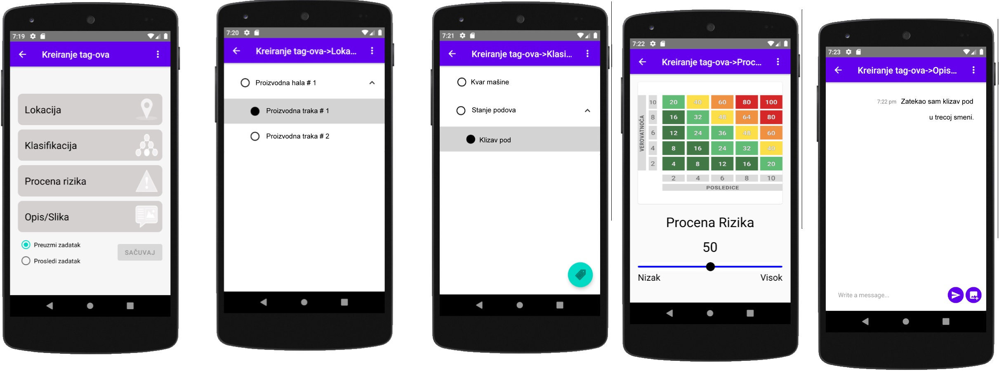
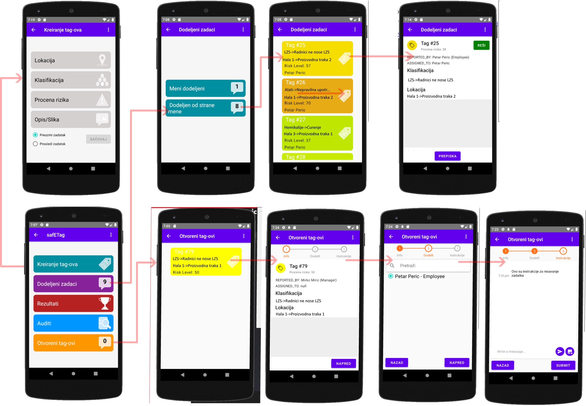

This repository is supplement to the study (http://dx.doi.org/10.1016/j.ssci.2019.07.024):

# SafE-Tag mobile: A novel javascript framework for real-time management of unsafe conditions and unsafe acts in SMEs

 
Arso M. Vukicevic*,1, Marko Djapan1, Miladin Stefanovic1,  Ivan Macuzic1   

 
1 Faculty of engineering, University of Kragujevac, Kragujevac, Serbia  
*Corresponding author {arso_kg@yahoo.com; +381643483552; Sestre Janjic 6, 34000 Kragujevac, Serbia}

Nowadays industries have initiative to reduce a number of production injuries and accidents down to zero. This goal could be achieved only through the proactive identification of accident precursors – such as unsafe conditions (UC) and unsafe acts (UA), whose control could prevent occurrence of accidents. At the same time, smartphones (and mobile applications) are taking dominance over PCs, making mobile devices major interface for human interaction with the web. In this term, application of mobile devices in OSH remains to be more exploited and accepted. Taking into account these trends, the present study aims to propose a novel cloud-based mobile framework for the management of UC/UA reports. Compared to previous studies, we considered the recent trends of mobile, cloud and Safety 4.0 in more details – ending up with the solution that is the combo of JavaScript technologies. 

Compared to the original study - this implementation is extended with new features, and the backend was reimplemented using the PHP programming language.

# Key features
• Management of unsafe conditions (UC) and unsafe acts (UA) could prevent accidents.\
• We propose a novel cloud-based mobile framework for the management of UC/UA reports.\
• Publically available use case named the SafE-Tag was provided.\
• Digitalized safety management enables measurement of workers′ contribution to safety.\
• ICT technologies enable employees to proactively learn and improve safety culture.

# GUI look (Serbian)

